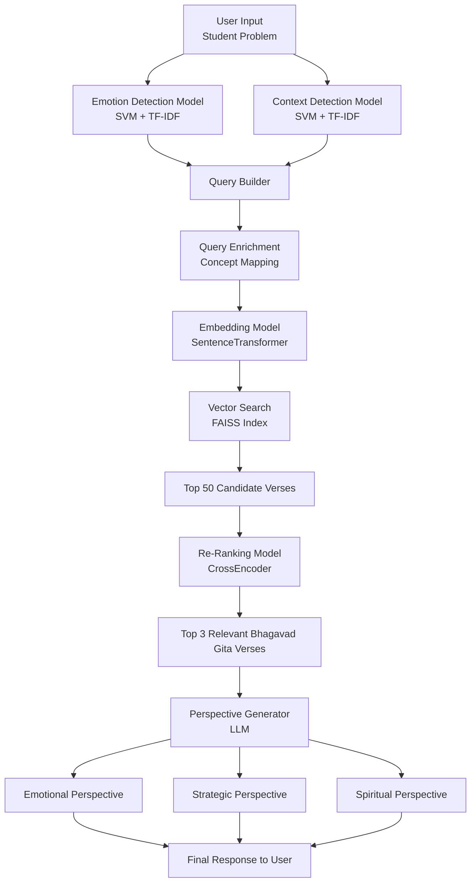

# Krishnas-Lens

Krishna’s Lens is a hybrid ML + LLM system designed to help teenagers reframe personal challenges through structured perspectives. The platform uses classical machine learning models (TF-IDF + SVM) to detect a user’s dominant emotion and life context from free-text input. Based on these predictions, it retrieves relevant Bhagavad Gita principles and generates three distinct viewpoints — emotional, strategic, and spiritual. The system combines interpretable ML classification with controlled language generation to deliver reflective, non-prescriptive guidance.

## 🧠 System Architecture

