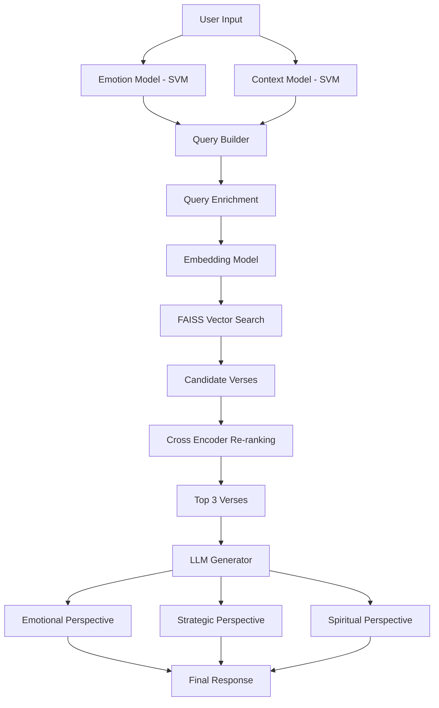

# Krishna’s Lens

### Krishna's teachings from Bhagvad Gita Inspired AI Guidance System

Krishna’s Lens is a hybrid **ML + RAG + LLM system** designed to help teenagers reflect on personal challenges through three structured perspectives — **Emotional, Strategic, and Spiritual** — inspired by the teachings of the Bhagavad Gita.

## 🚀 Overview

The system analyzes a user's problem using machine learning models to detect:

* **Emotion** (e.g., fear, pressure, self-doubt)
* **Context** (e.g., academics, peer pressure, identity)

It then retrieves relevant philosophical insights from the Bhagavad Gita using a **RAG (Retrieval-Augmented Generation)** pipeline and generates thoughtful responses using an LLM.


## 🏗️ Tech Stack

| Layer        | Technology Used |
|--------------|-----------------|
| Backend      | Node.js (Express) |
| Frontend     | React.Js |
| API          | FastAPI |
| Embeddings   | Sentence Transformers |
| Vector DB    | FAISS (local) |
| LLM          | Groq (Llama 3.1-8b-instant) |
| ML           | Python, Scikit-learn |
| ML Algorithms| SVM, TF-IDF |


## ⚙️ Project Structure

```
krishnas-lens/
│
├── frontend/              # React frontend
├── backend/               # Node.js backend
│
├── Machine_Learning/                # FastAPI service (ML inference layer)
|   |
│   ├── Dataset Preperation/
|   |   └──Dataset_Preperation.ipynb
|   |
│   ├── Datasets/
|   |   ├── gita_cleaned.csv
|   |
│   ├── ml_api/
|   |
│   └── model_training/
│       ├── emotion_model.pkl
│       ├── context_model.pkl
│       ├── tfidf_vectorizer.pkl
│       ├── context_vectorizer.pkl
│       ├── gita_index.faiss
│
└── README.md
```

---

## 🤖 ML Pipeline

### 1. Emotion Detection

* Model: **SVM + TF-IDF**
* Classes: fear, sadness, pressure, self_doubt, etc.

### 2. Context Detection

* Model: **SVM + TF-IDF**
* Classes: academics, peer_pressure, self_identity, etc.

## 🔍 RAG Pipeline

1. Query is built using:

   * User input
   * Emotion
   * Context

2. Query is enriched using **philosophical concept mapping**

3. SentenceTransformer generates embeddings

4. FAISS retrieves top candidate verses

5. Cross-Encoder re-ranks results

6. Top 3 verses are selected

⚙️ System Design-
Because Node.js cannot run Python ML models directly:

👉 A FastAPI service acts as the ML inference layer

~~~
Flow:
React → Node.js → FastAPI → ML + RAG + LLM → Response
~~~

## 🧠 Perspective Generator

Using an LLM (via Groq API), the system generates:

* **Emotional Perspective** → acknowledges feelings
* **Strategic Perspective** → suggests mindset/action
* **Spiritual Perspective** → deeper philosophical insight

## 🔌 FastAPI ML Service

Since Node.js cannot directly run Python ML models or SentenceTransformers, a **FastAPI service** is used as an inference layer.

### Responsibilities:

* Load trained `.pkl` models
* Run emotion & context prediction
* Perform RAG retrieval
* Generate perspectives via LLM

### 📍 Endpoint Example

```http
POST /analyze
```

**Request:**

```json
{
  "text": "I feel overwhelmed because exams are coming"
}
```

**Response:**

```json
{
  "emotion": "pressure",
  "context": "academics",
  "perspectives": {
    "emotional": "...",
    "strategic": "...",
    "spiritual": "..."
  }
}
```

## 🔄 How Everything Connects

```text
React (Frontend)
        ↓
Node.js Backend
        ↓
FastAPI (ML Service)
        ↓
ML Models + RAG + LLM
        ↓
Response → Frontend
```

## 🧪 Running the Project

### 1. Start FastAPI (ML Service)

```bash
cd Machine_Learning
pip install requirements.txt

cd ml_api
uvicorn app:app --reload
```

### 2. Start Backend

```bash
cd backend
npm install
npm run dev
```


### 3. Start Frontend

```bash
cd frontend
npm install
npm run dev
```

## 📌 Key Features

* Hybrid **ML + RAG + LLM architecture**
* Real-time emotion & context detection
* Bhagavad Gita-based knowledge retrieval
* Structured 3-perspective responses
* Cross-language system (Node + Python integration)

## ⚠️ Disclaimer

This system is designed as a **reflective guidance tool**, not a replacement for professional mental health support.


## 📈 Future Improvements

* Fine-tuned emotion classification (BERT)
* Better verse alignment using domain-specific embeddings
* Multi-language support
* Personalization based on user history

## Inspiration

Inspired by the teachings of the **Bhagavad Gita**, reimagined as a modern AI system for self-reflection and clarity.

---


## System Architecture


```mermaid
flowchart TD

A[User Input] --> B[Emotion Model - SVM]
A --> C[Context Model - SVM]

B --> D[Query Builder]
C --> D

D --> E[Query Enrichment]

E --> F[Embedding Model]

F --> G[FAISS Vector Search]

G --> H[Candidate Verses]

H --> I[Cross Encoder Re-ranking]

I --> J[Top 3 Verses]

J --> K[LLM Generator]

K --> L[Emotional Perspective]
K --> M[Strategic Perspective]
K --> N[Spiritual Perspective]

L --> O[Final Response]
M --> O
N --> O

```
```

